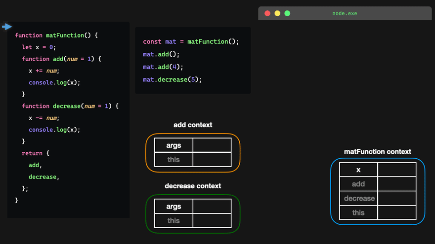

# Closures in Javascript

---

### What is a closure?
- A closure is the combination of a function bundled together (enclosed) with references to its surrounding state (the lexical environment). In other words, a closure gives you access to an outer function's scope from an inner function. In JavaScript, closures are created every time a function is created, at function creation time.
- A closure is a function that has access to its outer function scope even after the outer function has returned. This means a closure can remember and access variables and arguments of its outer function even after the function has finished.

#### i.e
```javascript
function outerFunction() {
    let outerVariable = 1;
    function innerFunction() {
        console.log(outerVariable + 10);
    }

    return innerFunction;
}

let newFunction = outerFunction();
newFunction(); // 11
```

- In the above example, the innerFunction() has access to the variables in the outer scope even after the outerFunction() has returned. This is called closure.

#### i.e



---

### # make variable private using closure
- In Javascript, we can make a variable private by creating it inside a function. And we can access that variable by creating a function inside that function.

- code :
    ```javascript
    let myFunction = (function (){
        let name = '' // private
        
        getName = function(){
            return name;
        }
        
        setName = function(newName){
            name = newName;
        }
        
        return {
            getName,
            setName
        }
    })();

    myFunction.setName('Dharmesh');

    console.log(myFunction.getName()); // Dharmesh
    console.log(myFunction.name); // undefined
    ```