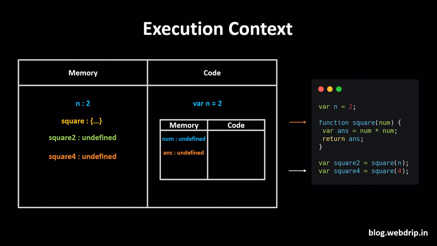
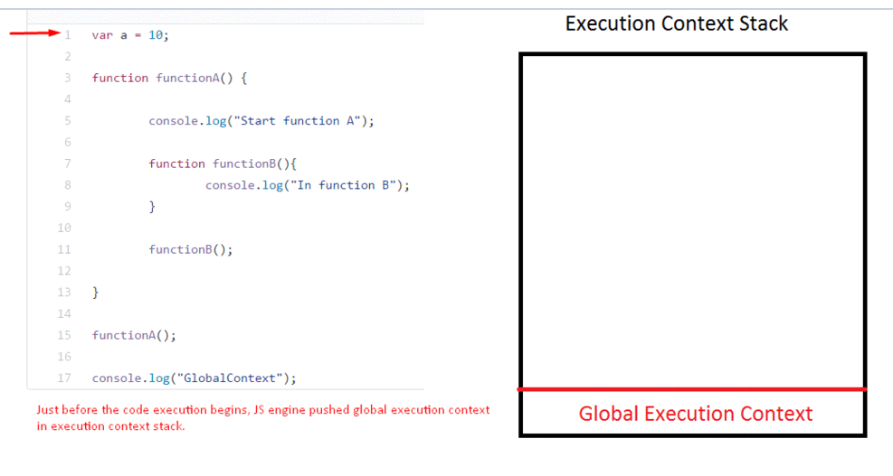

# All About Execution Context

---

- ### What is execution context in js?
    The JavaScript engine uses the execution context to keep track of the state of the code as it executes. This allows it to manage the memory, track variable assignments, and handle function calls and returns. Understanding execution contexts is crucial to understanding how JavaScript code executes and how variables and functions are scoped within that code.

- ### What is the execution context stack?
    The execution context stack is a stack with the execution contexts that are created during the execution of a script. The stack is used to determine the current execution context and what happens when functions are invoked.

- ### What is the global execution context?
    The global execution context is the first execution context created when a script is run. It is the outermost context and is the only context that is created before the code starts to execute. The global execution context is associated with the global object, which is the window object in the browser.                                          

- ### What is the function execution context?
    The function execution context is created when a function is invoked. It is associated with the function and provides a private scope for variables declared inside the function. The function execution context is pushed onto the execution context stack when the function is invoked and popped off the stack when the function returns.

- ### What is the variable environment?
    The variable environment is a data structure that holds identifier-variable mappings. It is used to store variables declared with var and function declarations. The variable environment is created when an execution context is created and is initialized with any function arguments and function declarations. The variable environment is used to resolve references to identifiers during execution.

- ### What is the lexical environment?  
    The lexical environment is a data structure that holds identifier-variable mappings. It is used to store variables declared with let and const. The lexical environment is created when an execution context is created and is initialized with any let and const declarations. The lexical environment is used to resolve references to identifiers during execution.

- ### What is the scope chain?
    The scope chain is a list of lexical environments that are searched for identifiers. The scope chain is created when an execution context is created and is initialized with the lexical environment of the execution context. The scope chain is used to resolve references to identifiers during execution.

- ### What is the this value?
    The this value is a special value that is associated with a function execution context. It is determined when a function is invoked and is used to provide a reference to the object of invocation. The this value is determined by the call-site of the function and can be set using call(), apply(), or bind().

- ### images

    

    

    

    

    